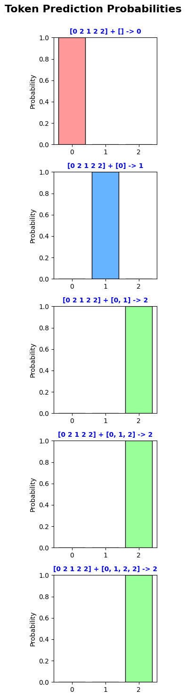
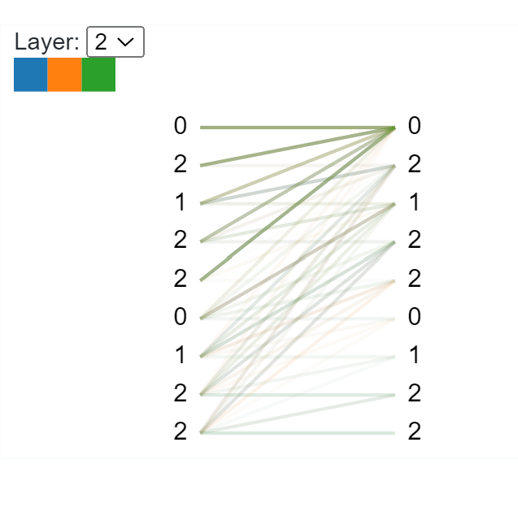
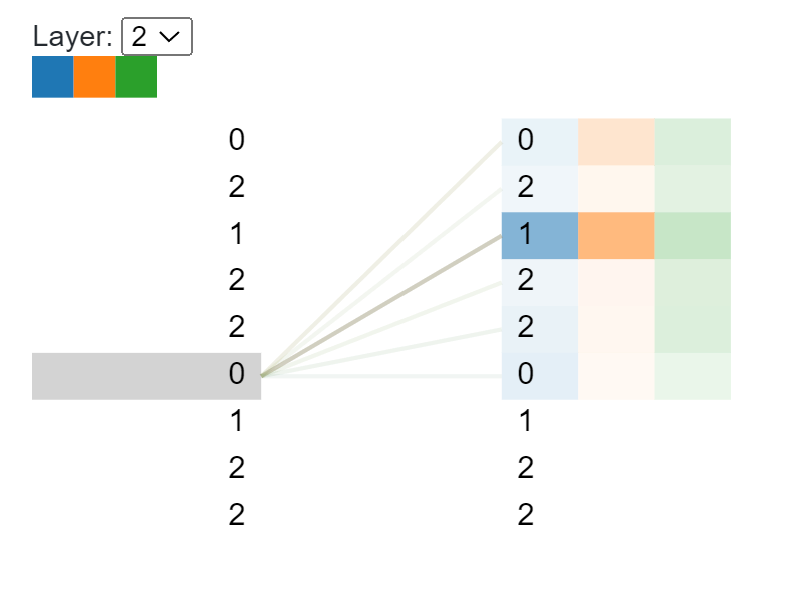

# Transformer Decoder (GPT-2 Style)

This is a PyTorch implementation of a transformer decoder model, similar to the architecture used in GPT-2.

## Usage
1. Configure the hyperparameters in `config.yaml`.
2. Train the model by running: `python demo.py -c config.yaml`.

## Model Architecture
The model consists of multiple stacked decoder blocks. Each decoder block includes a multi-head self-attention mechanism:

$\text{MultiHead}(Q, K, V) = \text{Concat}(\text{head}_1, \ldots, \text{head}_h)W^O$

where 

$\text{head}_i = \text{Attention}(QW^Q_i, KW^K_i, VW^V_i)$

The attention mechanism uses scaled dot-product attention:

$\text{Attention}(Q, K, V) = \text{softmax}\left(\frac{QK^T}{\sqrt{d_k}}\right)V$

All decoder blocks are causal, meaning the attention weights are masked to prevent attending to future tokens.

The feedforward layers in each block map the intermediate attention states from `d_model` to `mlp_ratio * d_model`, and then back to `d_model`.

The final layer is a linear layer that projects the output of the last decoder block to the vocabulary size, preparing it for the softmax output.

## Training
### Data
For testing purposes, the model is trained on a simple dummy dataset. Given a sequence of integers, the task is to predict the sorted version of the sequence in ascending order.

**Example:**
- Input: [1, 2, 1, 0, 1] → Prediction: [0, 1, 1, 1, 2]
- Input: [1, 0, 0, 1, 1] → Prediction: [0, 0, 1, 1, 1]

### Training Process
During training, the model is provided with an input sequence concatenated with the target sequence (denoted as `[input + target]`), and is trained autoregressively.

For an input sequence, say [1, 2, 1, 0, 1], the model sees:

- Input : [1, 2, 1, 0, 1, 0, 1, 1, 1]
- Target: [2, 1, 0, 1, 0, 1, 1, 1, 2] * [0, 0, 0, 0, 1, 1, 1, 1, 1]

The model optimizes using cross-entropy loss between the predicted output and the true target.
The prefix part of the target sequence is masked for loss calculation.

### Results
Results and visualizations can be found in `visualize.ipynb`. 

#### Probability Distribution of Predictions

  

#### Attention Weights
Last block attention weights:

  

Attention from one token to others:

  

## BPE Encoding

1. **Chunking Text:** The long input text is divided into smaller pieces based on predetermined rules.

2. **UTF-8 Conversion:** Each character in a piece is converted into its UTF-8 byte representation, then mapped to a unique unicode code point. Mainly for nice display.
   
3. **Byte Pair Merging:** Using the predefined merge rules from the `vocab.bpe` file, pairs of characters or byte sequences are iteratively merged to form larger units (subwords or word pieces). The process continues until no more merges can be applied.

4. **Token Integer Conversion:** Once merged, the resulting byte sequences (now subwords or tokens) are converted into integer representations using the mappings found in the `encoder.json` file. Each merged token is assigned a unique integer ID.

> Note: In the original GPT-2 implementation, special tokens like `<|endoftext|>` are not treated as individual tokens during encoding. Instead, they are appended as special indices during training. Hugging Face's tokenizers handle special tokens differently.

## References
 - Big reference: [karpathy/minGPT](https://github.com/karpathy/minGPT)
 - Other implementation reference: [openai/gpt-2](https://github.com/openai/gpt-2)
 - Visualization reference: [jessevig/bertviz](https://github.com/jessevig/bertviz)
 - Youtube tutorial that teaches debugging [How to Debug PyTorch Source Code - Deep Learning in Python](https://www.youtube.com/watch?v=el39D7rz7K0)